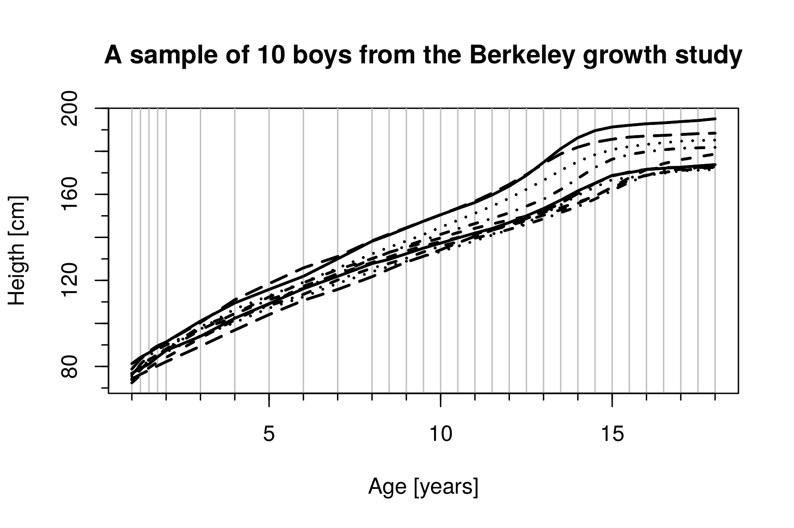
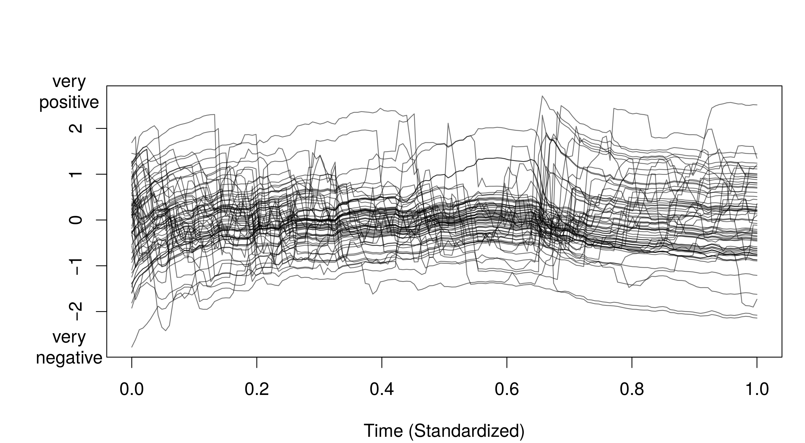
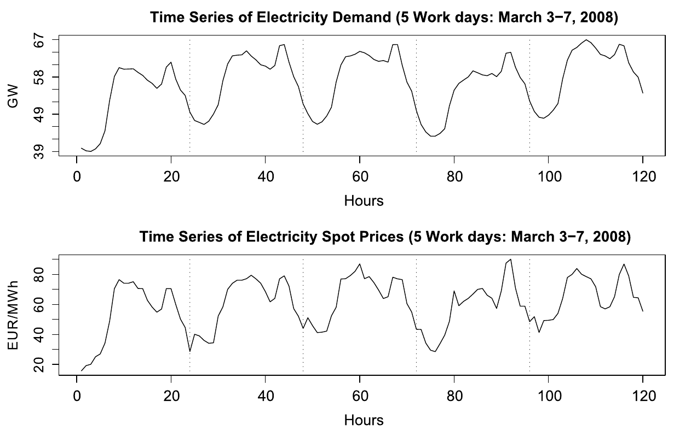
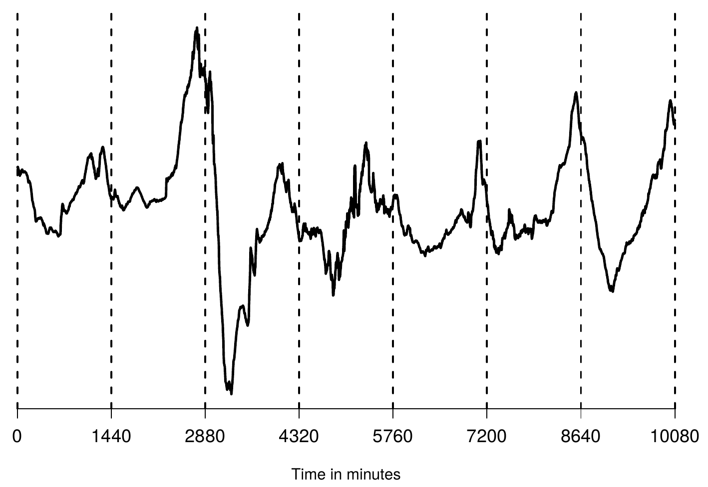
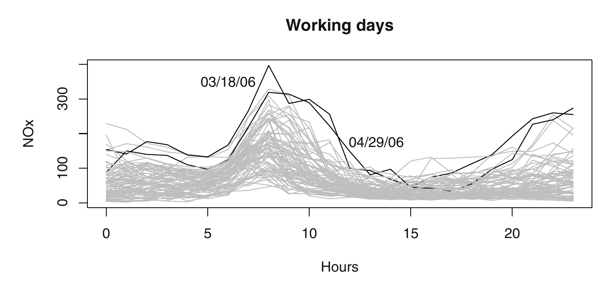

```{r setup, include=FALSE}
knitr::opts_chunk$set(echo = FALSE)
# install.packages(c("fda","png"))
## Load packages
library("fda")
data(growth)
```


## How to Use these Slides

Accampaning Book: 
```{r, fig.height=4, fig.align='center'}
library("png")
library("grid")
FDA_Book_Pic <- readPNG("./images/IntroFDA_Book.png")
grid.raster(FDA_Book_Pic)
```

Covered Chapters: Ch. 1 (1.1-1.4), Ch. ??? 


## How to Use these Slides

All examples are reproducable using the R-codes published at my GitHub account:
<br><br>
<div class="centered">
<bdi style="font-size:150%;"><b>https://github.com/lidom/</b></bdi>
</div>


##
<br><br><br><br><br><br><br>
<div class="red2">
<div class="centered">
<bdi style="font-size:350%;"><b>Functional Data</b></bdi>
</div>
</div>


## Functional Data
```{r FD1, out.width = "100%"}

```

## Functional Data
```{r FD2, out.width = "100%"}

```

## Functional Data
```{r FD4, out.width = "100%"}

```

## Functional Data
```{r FD5, out.width = "100%"}

```

## Functional Data
```{r FD6, out.width = "100%"}

```

##
<br><br><br><br>
<div class="red2">
<div class="centered">
<bdi style="font-size:350%;"><b>From Raw to Functional Data</b></bdi>
</div>
</div>

## From Raw to Functional Data

The simplest data set encountered in functional data analysis is a sample of the form:
$$
\begin{align}
x_i(t_j),\quad t_j\in[a,b],\quad i=1,\dots,n \quad j=1\dots,J.
\end{align}
$$
The (theoretical) objects we wish to study are smooth curves:
$$
\begin{align}
X_i(t),\quad t\in[a,b],\quad i=1,\dots,n \quad j=1\dots,J.
\end{align}
$$
```{r, fig.width=8, fig.height=3, fig.align='center'}
par(mfrow=c(1,2), mar=c(5.1, 4.1, 0, 2.1))
matplot(x=growth$age, y=growth$hgtf[,1:5], type="p", lty=1, pch=21, 
        xlab="age", ylab="height (cm)", cex.lab=1.2,col=1:5,bg=1:5,
        main="")
matplot(x=growth$age, y=growth$hgtf[,1:5], type="l", lty=1, pch=1, 
        xlab="age", ylab="height (cm)", cex.lab=1.2,
        main="")
par(mfrow=c(1,1), mar=c(5.1, 4.1, 4.1, 2.1))
```


## From Raw to Functional Data

**Basis expansions:**

Typically, the first step in working with functional data is
to express them by means of a basis expansion
$$
X_i(t)\approx\sum_{m=1}^M c_{im} B_m(t),\quad t\in[a,b],
$$
where $B_1(t),\dots,B_M(t)$ are some standard collection of basis functions like: 

- splines
- wavelets
- sine and cosine functions
- etc.


## From Raw to Functional Data

B-spline basis functions $B_1(t),\dots,B_M(t)$:

```{r, echo=TRUE, out.width = "80%", fig.align='center'}
bspl_bf <- create.bspline.basis(rangeval=c(0,1), norder=3, 
                                     breaks=seq(0,1,len=7))
plot(bspl_bf, main="B-spline Basis Functions", xlab="[a,b]=[0,1]")
```


## From Raw to Functional Data

Fourier basis functions $B_1(t),\dots,B_M(t)$:

```{r, echo=TRUE, out.width = "80%", fig.align='center'}
fourier_bf <- create.fourier.basis(rangeval=c(0,1), nbasis=5)
plot(fourier_bf, main="Fourier Basis Functions", xlab="[a,b]=[0,1]")
```


## From Raw to Functional Data

**Example:** Raw data
```{r, fig.align='center', out.width = "80%", echo=TRUE}
matplot(x=growth$age, y=growth$hgtf[,1:5], type="p", lty=1, pch=21, 
        xlab="age", ylab="height (cm)", cex.lab=1.2,col=1:5,bg=1:5,
        main="5 Girls in Berkeley Growth Study")
```


## From Raw to Functional Data

**Example:** Pre-processed data
```{r, fig.align='center', out.width = "80%", echo=TRUE}
SmObj <- smooth.basisPar(growth$age,y=growth$hgtf[,1:5],lam=0.1)
plot(SmObj$fd, xlab="age", ylab="height (cm)", cex.lab=1.2,
     main="5 Girls in Berkeley Growth Study", lty=1)
```


## From Raw to Functional Data

**Example:** Pre-processed data - 1st derivative
```{r, fig.align='center', out.width = "80%", echo=TRUE}
plot(deriv(SmObj$fd, 1), xlab="age", 
     ylab="growth rate (cm / year)", cex.lab=1.2,
     main="5 Girls in Berkeley Growth Study (1st derivative)", lty=1)
```


## From Raw to Functional Data

**Example:** Pre-processed data - 2nd derivative
```{r, fig.align='center', out.width = "80%", echo=TRUE}
plot(deriv(SmObj$fd, 2), xlab="age", cex.lab=1.2,
     ylab="growth acceleration (cm / year^2)",
     main="5 Girls in Berkeley Growth Study (2nd derivative)", lty=1)
```

##
<br><br><br><br>
<div class="red2">
<div class="centered">
<bdi style="font-size:350%;"><b>Sample Mean and Covariance</b></bdi>
</div>
</div>


## Sample Mean and Covariance

**Pointwise mean:**
$$
\hat{\mu}_n(t)=\bar{X}_n(t)=\frac{1}{n}\sum_{i=1}^n X_i(t)
$$
**Pointwise standard deviation:**
$$
S_n(t)=\sqrt{\frac{1}{n-1}\sum_{i=1}^n\Big(X_i(t)-\bar{X}_n(t)\Big)^2}
$$

## Sample Mean and Covariance

**Pointwise mean and standard deviation:**

```{r, eval=FALSE, echo=TRUE}
Wiener.Mean <- rowMeans(Wiener.mat)
Wiener.SD   <- apply(Wiener.mat, 1, sd)
```

```{r, echo=FALSE, fig.align='center', fig.width=8, fig.height=4}
set.seed(109)
n           <- 50
J           <- 500
Wiener.mat  <- matrix(0, ncol=n, nrow=J)
for(i in 1:n){Wiener.mat[,i] <- cumsum(rnorm(J, sd = 1/100))}
Wiener.Mean <- rowMeans(Wiener.mat)
Wiener.SD   <- apply(Wiener.mat,1,sd)
xx          <- seq(0,1,len=J) 
par(mfrow=c(1,2))
matplot(x=xx, y=Wiener.mat, xlab="", ylab="", type="l", col=gray(.7), lty=1, main="Wiener process")
lines(x=xx, y=Wiener.Mean)
lines(x=xx, y=Wiener.SD, lty=2)
legend("topleft", lty = c(1,2), legend = c("Sample Mean","Sample SD"))
matplot(x=xx, y=Wiener.mat, xlab="", ylab="", type="l", col=gray(.7), lty=1, main="Wiener process")
lines(x=c(0,1), y=c(0,0), lty=1)
lines(x=c(0,1), y=c(0,sqrt(J*(1/100)^2)), lty=2)
legend("topleft", lty = c(1,2), legend = c("True Mean","True SD"))
par(mfrow=c(1,1))
```

## Sample Mean and Covariance

**Pointwise covariance function:** 
$$
\hat{c}_n(t,s)=\frac{1}{n-1}\sum_{i=1}^n\Big(X_i(t)-\bar{X}(t)\Big)\Big(X_i(s)-\bar{X}(s)\Big)
$$


- The sample covariance function is extensively used in Functional Data Analysis (FDA). 
- The interpretation of the values of $\hat{c}_n(t,s)$ is the same as for the usual variance-covariance matrix. 


## Sample Mean and Covariance

**Pointwise covariance function:** 
```{r, eval=FALSE, echo=TRUE}
Wiener.Cov <- var(Wiener.mat)
```


```{r, echo=FALSE, fig.align='center', out.width="100%"}
Wiener.cov <- var(t(Wiener.mat))
slct <- c(seq.int(1,500,by=20),500)
par(mfrow=c(1,2), mar=c(1, 1.1, 1.2, 1.1))
persp(xx[slct], xx[slct], Wiener.cov[slct,slct], xlab="s", ylab="t", zlab="",main="Sample Covariance Function",
      theta = -40, phi = 20, expand = .75, col = "blue", shade = 1.05)
x <- seq(0, 1, length= 30); y <- x
f <- function(x, y){min(x,y)}
f <- Vectorize(f)
z <- outer(x, y, f)
persp(x, y, z, xlab="s", ylab="t", zlab="",
      main="True Covariance Function",
      theta = -40, phi = 20, expand = .75, col = "blue", shade = 1.05)
par(mfrow=c(1,1), mar=c(5.1, 4.1, 4.1, 2.1))
```

##
<br><br><br>
<div class="red2">
<div class="centered">
<bdi style="font-size:350%;"><b>Principal Component Functions
</b></bdi>
</div>
</div>


## Principal Component Functions

- **Idea:** Use the Estimated Functional Principal Components (EFPC's)  $\hat{v}_j$ as basis functions for representing the centered functions $X_i-\bar{X}_n$:
$$
X_i(t)-\bar{X}_n(t)\approx\sum_{j=1}^p\hat{\xi}_{ij}\hat{v}_j(t)
$$

- Estimated scores: $\hat{\xi}_{ij}=\int_a^b (X_i(t)-\bar{X}_n(t))\hat{v}_j(t)dt$
- EFPC's are **orthonormal**, i.e.
$$\textstyle\int_a^b\hat{v}_j(t)\hat{v}_k(t)dt=\begin{cases}1, &j=k\\0,&j\neq k.\end{cases}$$


## Principal Component Functions 

$$
\begin{align}
\hat{c}_n(t,s)&\approx\sum_{j=1}^p\hat{\lambda}_j\hat{v}_j(t)\hat{v}_j(s),
\end{align}
$$
where $\hat{\lambda}_1>\dots >\hat{\lambda}_p$ denote the estimated eigenvalues.
```{r echo=FALSE, fig.align='center', fig.height=3}
BSPL.basis <- create.bspline.basis(rangeval=c(0,1), nbasis=100)
Wiener.fd  <- smooth.basis(argvals=xx, y=Wiener.mat, fdParobj=BSPL.basis)
# Wiener.pca <- pca.fd(Wiener.fd$fd, nharm=4)
# round(Wiener.pca$varprop,2)
# plot(Wiener.pca$harmonics, lwd=3, ylab="", main="Estimated FPC's")


Wiener.pca <- pca.fd(Wiener.fd$fd, nharm=3)
par(mfrow=c(1,3), mar=c(2.1, 1.1, 4.1, 1.1))
persp(xx[slct], xx[slct], Wiener.cov[slct,slct], xlab="s", ylab="t", zlab="",
      main="Sample Covariance Function", theta = -40, phi = 20, expand = .75, col = "blue", shade = 1.05)
invisible(plot(Wiener.pca$values[1:3], type="o", ylab="", main="Estimated Eigenvalues (p=3)"))
invisible(plot(Wiener.pca$harmonics, lwd=3, ylab="", main="Estimated FPC's (p=3)"))
par(mfrow=c(1,1))
```


## Principal Component Functions

$$
\begin{align}
X_i(t)&\approx\bar{X}_n(t) + \sum_{j=1}^p\hat{\xi}_{ij}\hat{v}_j(t)
\end{align}
$$
```{r echo=TRUE, echo=FALSE, fig.align='center', fig.height=4}
Wiener.pca <- pca.fd(Wiener.fd$fd, nharm=15)
v_hat_mat  <- eval.fd(xx, Wiener.pca$harmonics)
xi_hat_mat <- Wiener.pca$scores

# FPCA-approx
X_fpca_fit <- Wiener.Mean + (xi_hat_mat %*% t(v_hat_mat)) 

# plot
par(mfrow=c(1,1), mar=c(5.1, 4.1, 2.1, 2.1))
invisible(plot(Wiener.fd$fd[1], lwd=1.3, main="Approximation of Brownian Motion (p=15)"))
lines(y=X_fpca_fit[1,], x=xx, col="red", lwd=1.3)
```


##
<br><br><br>
<div class="red2">
<div class="centered">
<bdi style="font-size:350%;"><b>Case Study:<br> BOA Stock Returns
</b></bdi>
</div>
</div>

## Case Study: BOA Stock Returns

- Bank of America (BOA) stock values $P_i(t_j)$
    - $i=1,\dots,n=2511$ denotes the **trading days** <br>
      (from April 9th, 1997 to April 2nd, 2007).
    - $t_j\in[0,6.5]$ denotes **intra-day trading time** <br>
      (6.5 hours / per trading day). 
    - Minute-wise measurements: $j=1,\dots,J=390$.


We study the daily **cumulative log-return** functions:
$$R_i(t):=\log(P_i(t))-\log(P_i(0))\approx\frac{P_i(t)-P_i(0)}{P_i(0)}$$


## Case Study: BOA Stock Returns

```{r, echo=TRUE, eval=TRUE}
# Data
BOA        <- read.csv(file = "https://raw.githubusercontent.com/lidom/Teaching_Repo/master/stock_prices.csv",
                       header = TRUE, sep = " ", dec = ",")
Dates      <- dimnames(BOA)[[1]]
BOA        <- data.matrix(BOA)
BOA        <- BOA[-which(Dates=="08/26/2004"),]# Outlier
n          <- dim(BOA)[1]
J          <- dim(BOA)[2]
Times      <- seq(0,6.5,length=J)

# Cumulative log-return functions (raw data)
log_BOA    <- log(BOA) - matrix(log(BOA)[,1], nrow=n, ncol=J)

# B-spline basis functions
bspl_basis <- create.bspline.basis(rangeval=c(0,6.5),nord=4,nb=200)

# Cumulative log-return functions (with basis functions)
log_BOA_fd <- Data2fd(Times,t(log_BOA),basisobj = bspl_basis)
```


## Case Study: BOA Stock Returns
```{r, eval=FALSE, echo=TRUE}
# Plot functional data
plot(log_BOA_fd, xlab="Trading Hours",ylab="",lwd=1, col=gray(.5), 
     main="Cumulative Log-Return Functions")
lines(log_BOA_fd[1:10],lwd=1.5, lty=1)
```

```{r, eval=TRUE, echo=FALSE, fig.align='center', fig.height=4}
par(mfrow=c(1,1), mar=c(5.1, 4.1, 2.1, 2.1))
invisible(plot(log_BOA_fd, xlab="Trading Hours",ylab="",lwd=1, col=gray(.5), 
               main="Cumulative Log-Return Functions"))
lines(log_BOA_fd[1:10],lwd=1.5, lty=1)
```


## Case Study: BOA Stock Returns
```{r echo=FALSE, fig.align='center', fig.cap="Plot of mean function for BOA cumulative returns. Point-wise 95% confidence intervals are included in red."}
muhat          <- mean.fd(log_BOA_fd)
sdhat          <- sd.fd(log_BOA_fd)
SE_hat_U       <- fd(basisobj=bspl_basis) # create upper CI bound
SE_hat_L       <- fd(basisobj=bspl_basis) # create lower CI bound
SE_hat_U$coefs <-  2*sdhat$coefs/sqrt(n) + muhat$coefs
SE_hat_L$coefs <- -2*sdhat$coefs/sqrt(n) + muhat$coefs 
# plot
invisible(plot.fd(SE_hat_U,ylim=c(-0.002,0.002),col='red',lty=2,
                  xlab="Trading Hours",ylab="Returns", main="Mean Function with 95% CI"))
invisible(plot.fd(SE_hat_L,add=TRUE,col='red',lty=2))
invisible(plot.fd(muhat,add=TRUE))
```


## Case Study: BOA Stock Returns
```{r echo=FALSE, fig.cap="EFPC's of BOA cumulative returns versus the theoretical eigenfunctions of Brownian Motions.", fig.align='center'}
log_BOA_fpca  <- pca.fd(log_BOA_fd, nharm=4)
# Eigenfunctions of Wiener process
efwp_fun      <- function(x, k=1){sqrt(2)*sin((k-1/2)*pi*x)}
# integrate(function(x){(efwp_fun(x,k=1))^2}, lower = 0, upper = 1)
EFWP_mat      <- cbind(efwp_fun(x=xx,k=1), efwp_fun(x=xx,k=2), efwp_fun(x=xx,k=3), efwp_fun(x=xx,k=4))
# plot
par(mfrow=c(1,2))
invisible(plot(log_BOA_fpca$harmonics, main="Estimated Eigenfunctions of\nCumulative Return Functions",
               xlab="Trading Hours", ylab=""))
matplot(x = xx, y=EFWP_mat, type="l",  main="True Eigenfunctions of\nWiener Process",ylab="",xlab="")
```


##
<br><br>
<div class="centered">
<div class="red2">
<bdi style="font-size:300%;">
<b>Mathematical Framework:<br></b>
</bdi>
<div class="blue">
<bdi style="font-size:300%;">
<b>Square Integrable Functions</b>
</bdi>
</div>
</div>


##  Square Integrable Functions

<!-- - Let's consider standardized intervals $[a,b]=[0,1]$.<br> -->
<!--   Standardization: $t^{\text{new}}=(t^{\text{old}}-a)/(b-a)$. -->

- A function $f$ is said to be **square integrable**, i.e., $f\in L^2([a,b])$ if
$$
\textstyle\int_a^b f^2(t)dt=\int_a^b \big(f(t)\big)^2 dt<\infty.
$$
- Square integrable functions form a **vector space**, i.e., for $c,d\in\mathbb{R}$: 
$$g,f\in L^2([a,b])\quad\Rightarrow\quad cf+dg\in L^2([a,b]),$$ 
where <br>
$(cf+dg)(t)=cf(t)+dg(t)$ for *almost all* $t\in[0,1]$. 
<br><br>
(Note: We will ignore measure-theoretic considerations.)


##  Square Integrable Functions


What makes the space $L^2([a,b])$ so convenient is its structure:

- **Inner product** of two functions by
$$
\textstyle\langle f,g\rangle=\int_a^bf(t)g(t)dt.
$$
-  Two functions $f$ and $g$ are **orthogonal** if 
$$\langle f,g\rangle=0.$$

- The **norm** $||f||=\sqrt{\langle f,f\rangle}$, gives us a notion for the distance between two functions: $$d(f,g)=||f-g||$$


##  Square Integrable Functions

As we have already seen, basis expansions play an important role in
methodology for functional data. 

- We say that a set of functions $\{e_1 ,e_2,e_3,\dots\}$
is a **basis** in $L^2([a,b])$ if every function $f\in L^2([a,b])$ admits a *unique* expansion
$$
\textstyle f(t)=\sum_{j=1}^\infty a_j e_j(t)
$$
- We say that $\{e_1 ,e_2,e_3,\dots\}$ is an **orthonormal basis** if, in addition
$$\langle e_j , e_k\rangle=\begin{cases}1, &j=k\\0&j\neq k.\end{cases}
$$ 


##
<br><br>
<div class="centered">
<div class="red2">
<bdi style="font-size:300%;">
<b>Mathematical Framework:<br></b>
</bdi>
<div class="blue">
<bdi style="font-size:300%;">
<b>Random Functions</b>
</bdi>
</div>
</div>


## Random Functions

Let $X$ denote a **random function** defined on a probability space, say
$\Omega$.


- We assume that *all* realizations $X(\omega)$, $\omega\in\Omega$, are elements of the space $L^2([a,b])$ of square integrable functions, i.e <br><br>
$||X(\omega)||=\sqrt{\int_a^b \big(X(\omega)(t)\big)^2dt} < \infty$ for all $\omega\in\Omega$.

- $||X||\in\mathbb{R}$ is thus a real random variable. 

- If $E(||X||^2)<\infty$, we say that the **random function $X$ is square integrable**. 
**Caution:** Integration is here with respect to $\omega$, not $t$. It might be more pedagogical to say that the **random function $X$ has a finite second moment**. 


## Random Functions

- **Mean function:**
$$
\mu(t)=E(X(t))
$$
- **Covariance function:**
$$
c(t,s)=E\Big((X(t)-\mu(t))(X(s)-\mu(s))\Big)
$$
The sample functions $\hat{\mu}_n$ and $\hat{c}_n$ are viewed as estimators of the population parameters $\mu$ and $c$.


## Random Functions 

The covariance function leads to **Functional Principal Component Analysis** (FPCA), which allows us to represent a square integrable random function $X$ as
$$
\textstyle X(t)=\mu(t)+\sum_{j=1}^\infty\xi_j v_j(t),
$$

- The **eigenfunctions** $v_j$ are the solutions of the eigen-equation
$\int_a^bc(t,s)v_j(s)ds=\lambda_jv_j(t)$. 

- $\lambda_1,\lambda_2,\dots$ denote the **eigenvalues**. 

- The *random variables* $\xi_j$ are called the **scores**
$$
\textstyle \xi_j=\langle X-\mu,v_j\rangle=\int_a^b(X(t)-\mu(t))v_j(t)dt. 
$$
<!-- - Typically, the eigenvalues, and so the corresponding eigenfunctions $v_j$ are arranged in nonincreasing order: $\lambda_1 \geq \lambda_2 \geq\dots$.  -->

## Random Functions 

FPCA allows us to represent a square integrable random function $X$ as (Karhunen-Loéve expansion)
$$
\textstyle X(t)=\mu(t)+\sum_{j=1}^\infty\xi_j v_j(t).
$$

It can be shown that:
$$
E(\xi_j)=0,\; V(\xi_j)=E(\xi_j^2)=\lambda_j, \; \operatorname{Cov}(\xi_j,\xi_k)=0,\,j\neq k,
$$
and $E\int_a^b(X(t)-\mu(t))^2dt=E||X-\mu||^2=\sum_{j=1}^\infty\lambda_j$.

That is, $\lambda_j$ is the variance of the random function $X$ **in the principal direction** $v_j$ and the sum of these variances is the **total variance** of $X$. 


